<h1 align="left">
  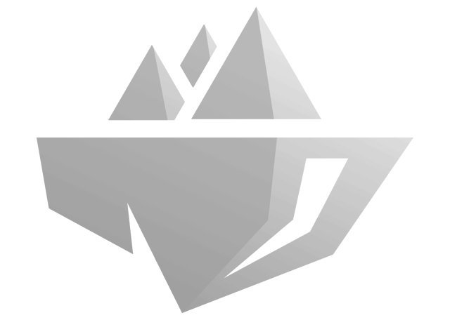
  Procedural Floating Islands
</h1>

**Procedural Floating Islands (PFI)** is a plugin for Unreal Engine 5 that generates fully deterministic procedural floating islands
all driven by reusable data assets, directly in the editor or at runtime in your game. No code required.

**One data asset, multiple seeds, infinite variations.**

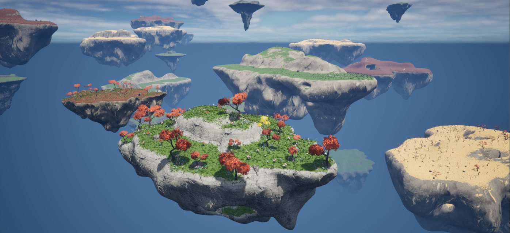
## Table of Contents
- [Key Features](#key-features)
- [Getting Started](#getting-started)
- [Editor](#editor)
  - [Live Preview Editors](#live-preview-editors)
  - [In Level Details Panel](#in-level-details-panel)
  - [Export](#export)
- [Island Shape](#island-shape)
  - [Base Shape](#base-shape)
  - [Noise Layers](#noise-layers)
  - [Deformations](#deformations)
  - [Sub-Islands](#sub-islands)
  - [Caves and Tunnels](#caves-and-tunnels)
  - [Paths](#paths)
  - [Render Settings](#render-settings)
- [Surface Population](#surface-population)
  - [Sampling Categories](#sampling-categories)
  - [Density and Distribution](#density-and-distribution)
  - [Spatial Rules](#spatial-rules)
  - [Transform Rules](#transform-rules)
  - [Ecosystem Interactions](#ecosystem-interactions)
- [Blueprint API](#blueprint-api)
- [Replication and Multiplayer](#replication-and-multiplayer)
- [Performance](#performance)
- [Extensibility for Developers](#extensibility-for-developers)

## Key Features
**Fully procedural, fully non-destructive.** Every island is generated from a data asset and a seed. Change a value, hit regenerate, and the result updates instantly in the editor and at runtime.

**Every parameter supports randomization.** Each numeric value exposes a minimum, a default, and a maximum. The seed resolves every parameter within its range. The same asset produces countless believable variations without any manual work.

**A complete shape pipeline.** Base form, multi-layer noise, geometric deformations (Twist, Bend, Flare), recursive sub-islands, procedural caves with optional tunnels, and surface paths all in one asset.

**A complete population system.** Poisson disk sampling, noise-driven density, surface slope filtering, cave-aware and path-aware placement rules, per-category ecosystem interactions, and HISMC rendering for thousands of instances with minimal draw calls.

**A professional editor experience.** Both the shape and population assets open in dedicated editors with live 3D previews.

**Export to static mesh.** Any generated island can be baked into a Static Mesh asset.

**No game thread blocking.** Generation runs on a background thread. The mesh is delivered progressively in batches. Safe to trigger at any point in gameplay.

**Blueprint and multiplayer ready.** Full Blueprint API with state queries and events. Key properties are replicated, share a seed across the network and every client builds the same island independently.

## Getting Started
1. Enable the **Procedural Floating Islands** plugin in your project settings.
2. In the Content Browser, right-click and open the **Procedural Floating Island (PFI)** category.
3. Create a **PFI Data** asset and open it. A live preview appears immediately.
4. Drag a **PFI Actor** into your level and assign the PFI Data asset.
5. Optionally create a **PFI Sampling Data** asset and assign it to populate the surface.
6. Assign a M_PFI instance material, or your material.
7. Press **Generate**, or enable **Regenerate On Property Changed** to iterate live.

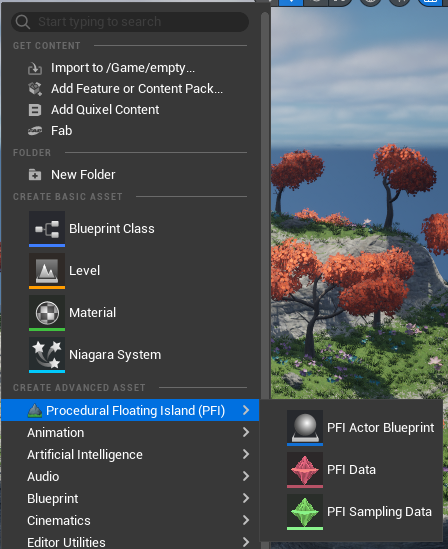
## Editor
### Live Preview Editors
Opening a **PFI Data** asset launches a dedicated editor window with a live 3D preview that updates automatically as you change any parameter.
A preview material and a preview Sampling Data asset can be assigned directly in this editor, giving you a fully dressed, in-context view of the island before placing it anywhere in a level.

Opening a **PFI Sampling Data** asset shows a similar dedicated editor, with a live preview of all instances distributed across a generated island surface.
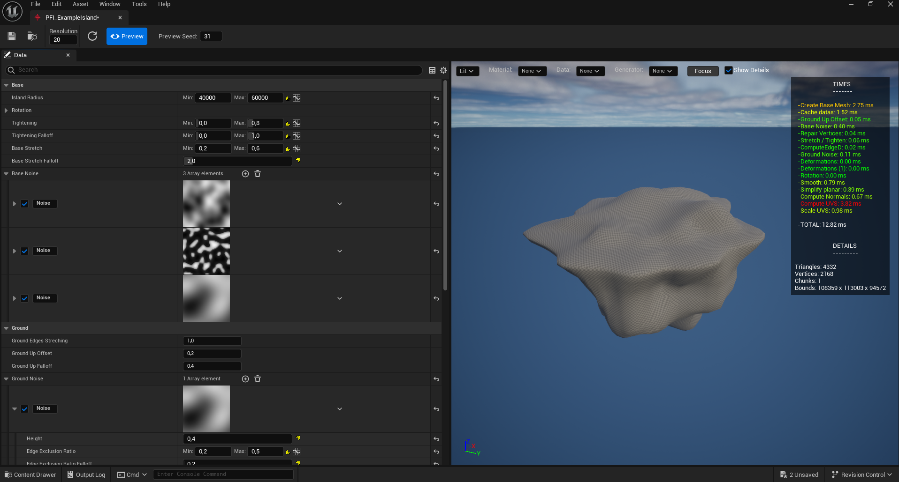

### In-Level Details Panel
When a PFI Actor is selected in the level, the Details panel exposes a dedicated **Actions** section at the top with everything needed to drive the island without opening a Blueprint or writing a line of code.

A live **status indicator** shows the current state of the island in real time: green when ready, yellow while the mesh is being computed or instances are being spawned.
Next to it, a **lock icon** toggles generation protection: when locked, no regeneration can occur accidentally, regardless of property changes.

Three buttons sit directly below. **Generate** rebuilds the island from the current parameters and seed. **Random Seed** picks a new seed and regenerates immediately. **Clear** destroys all generated meshes and instances.

The **Export Static Mesh** button opens the export dialog directly from the Details panel, without navigating anywhere else.

Note that these buttons are only available when the actor is placed in a level. Inside the Blueprint editor, the panel displays an informational message instead: generation is a runtime and level editor operation, not a Blueprint compilation step.

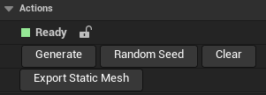
### Export
Any generated island can be exported to a **Static Mesh asset** directly from the editor with a single click.

From there, it is also possible to generate a **Blueprint Actor** that contains the exported Static Mesh by default and optionally, the **Hierarchical Instanced Static Mesh components** as well, preserving the full surface population alongside the geometry in a single self-contained Blueprint.

The result can be shared between projects, handed off to other team members, or distributed as packaged content. This makes PFI a capable standalone creation tool even in projects that do not use runtime generation at all.

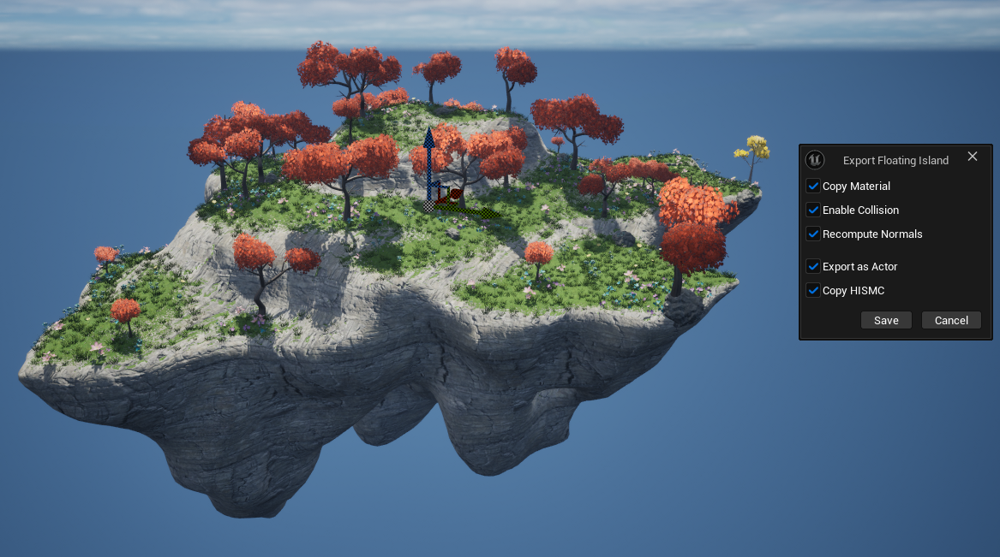

Results:

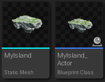
## Island Shape
Island shapes are described by a **PFI Data** asset. Every numeric parameter in this asset is ranged, each holds a default value, a minimum, and a maximum. At generation time, the seed resolves each parameter to a value within its range, producing a unique but fully controlled result.

### Base Shape
The base shape controls the fundamental silhouette of the island.

**Resolution** sets the triangle density of the generated mesh, from 10 to 500. **Island Radius** controls the overall scale. **Rotation** applies a random angular offset to the entire shape.

**Tightening** pinches the underside to create the classic floating rock silhouette, and its **Falloff** controls how gradually that pinch fades toward the edges. **Base Stretch** widens the lower body of the island, with its own **Falloff** for a gradual transition.

The **Ground** section handles the top surface separately. A vertical offset lifts it above the tapered body, and a falloff manages the transition between the flat top and the underside.

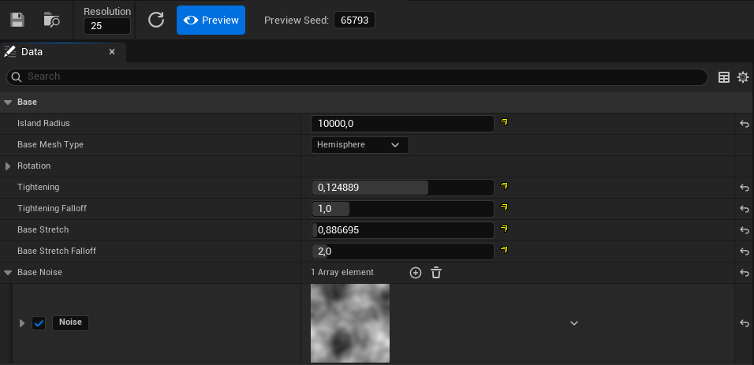
### Noise Layers

PFI uses **FastNoiseLite** throughout, exposing its full feature set through the editor. Noise layers can be stacked freely, each is independent and contributes with its own weight.

Six noise types are available: OpenSimplex2, OpenSimplex2S, Cellular, Perlin, ValueCubic, and Value. Five fractal modes complete the set: FBm, Ridged, PingPong, Domain Warp Progressive, and Domain Warp Independent. Cellular noise further exposes its distance function (Euclidean, Manhattan, Hybrid) and return type. Domain Warp has its own type selection and amplitude parameter.

Every layer includes an optional **curve remapping**. The raw noise output is passed through a float curve before being applied, giving precise control over the exact shape of each contribution: sharpen peaks, flatten valleys, or invert the response entirely.

Every layer also has an **activation probability** between 0 and 1. Set it below 1.0 and the layer may be skipped entirely on any given generation.

Two noise contexts exist in the shape asset. **Base Noise** deforms the overall island body. **Ground Noise** works exclusively on the top surface. It adds dedicated parameters: height, edge exclusion ratio, edge falloff, and organic edge perturbation to keep the island edges clean while allowing terrain relief in the interior.

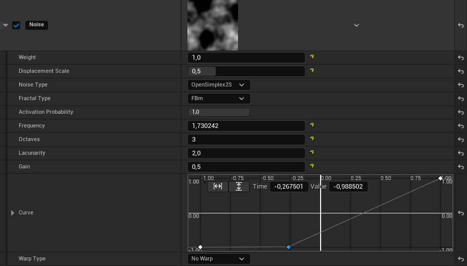
### Deformations

Deformations are geometric operations applied to the mesh after base shape and noise. They can be stacked in any order. A **Deformations** array runs before sub-islands are merged; a **Post Deformations** array runs after, affecting the entire final shape.

**Twist** rotates the mesh around its vertical axis, with the angle increasing progressively from base to top. A lock-bottom option keeps the base stationary while the top spins.

**Bend** curves the island in a fully configurable direction. Both orientation and angle are ranged. A lower extent parameter protects the base from bending, keeping the silhouette grounded even at strong angles.

**Flare** expands or contracts the mesh radially, with three available profile curves; Linear, Sin, and SinSquared. Each producing a distinctly different shape. Separate X and Y ratios allow asymmetric silhouettes.

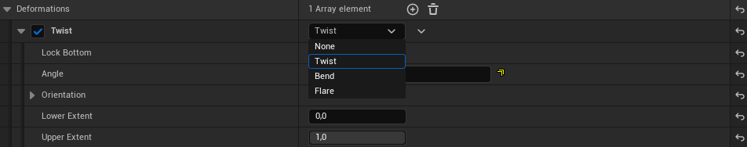
### Sub-Islands

A single PFI Data asset can generate an entire cluster. Sub-islands are full islands generated and then merged into the parent mesh. Each child can itself define sub-islands, making the system fully recursive. Maximum nesting depth is configurable up to 50 levels, with a recursion guard preventing runaway generation.

**Island Count** (ranged) controls how many children are generated. **Islands Deviation** determines placement style: at 0, children are placed at geometrically regular intervals; at 1, they are scattered organically within their sectors. **Island Distance** controls whether the islands merge together, touch at their edges, or float at a clear distance from one another. **Z Offset Ratio** positions each child at a relative vertical offset from the parent.

Each sub-island entry can reference an **existing PFI Data asset** or define its configuration **inline**. A single top-level asset can describe a complex multi-part formation without requiring additional actors or assets.

### Caves and Tunnels

Caves are procedurally carved voids inside the island body. Cave count is ranged and seed-resolved. Each cave preset independently controls its size relative to the island radius, how deeply it is buried into the rock, its flatness from fully spherical to a flat disc, and a noise layer that deforms the cavity boundary for organic variation.

Each cave can optionally generate a **tunnel** connecting a random point on the island surface to the cave interior. Tunnel parameters include radius, flatness, cross-section resolution, and two independent noise layers: one applied radially to produce irregular walls, and one applied along the tunnel direction to produce curved, winding paths.

Cave geometry is tracked separately throughout the generation pipeline and exposed to the sampling system, enabling placement rules that are spatially aware of cave boundaries: spawn inside, outside, or without restriction.

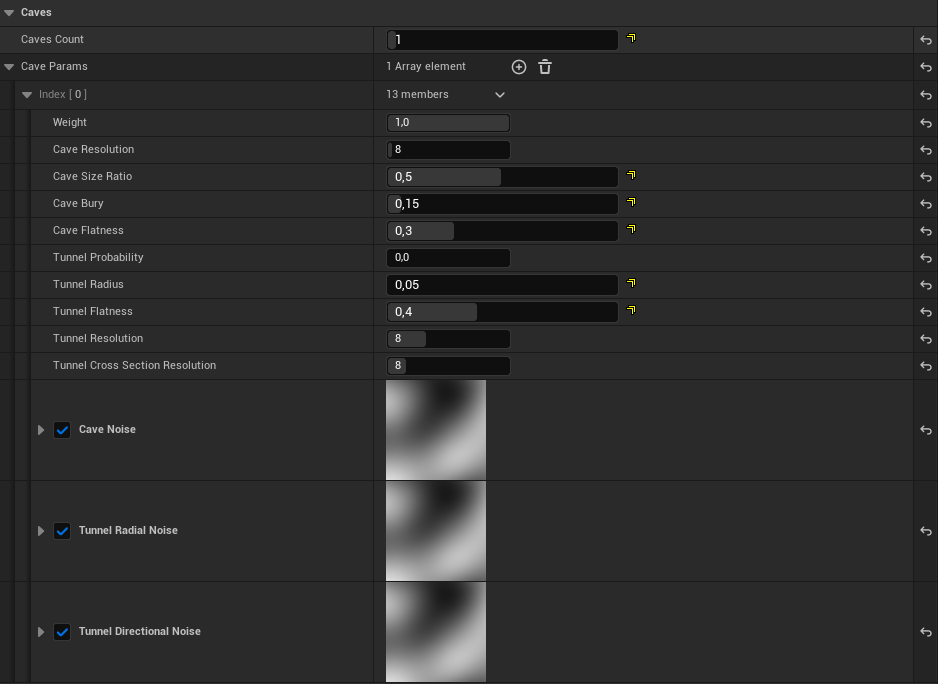
### Paths

Paths are procedural splines running across the top surface of the island. Each path defines a width, a start and end point mode (random surface point, island edge, or center), an optional loop, and a noise-driven lateral curvature that gives it an organic, natural feel. Up to 10 paths are supported per island, each described by up to 64 spline points.

Paths are resolved during generation and made available to the sampling system, which uses distance-to-path checks to control where instances are allowed to spawn.  They can clear vegetation along corridors, concentrate props beside trails, or guide any arrangement of surface elements with precise radius and falloff controls.
The same data is also passed to the M_PFI material as a dynamic texture, allowing the material to paint path surfaces directly onto the island geometry.

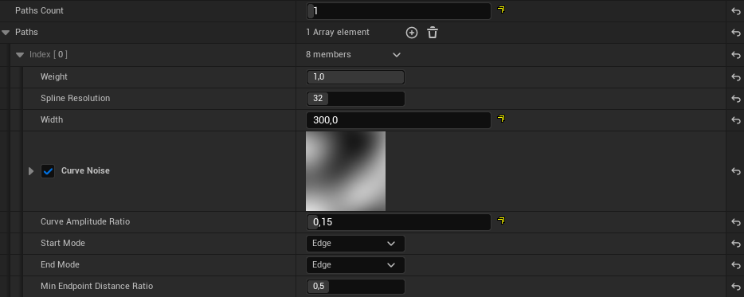
### Render Settings

The Render Parameters section controls how the output mesh is finalized before being handed to the render system.

**Remeshing** offers four modes. None skips the step entirely for maximum generation speed. SDF voxelizes the shape and reconstructs it using marching cubes, producing a fully watertight solid mesh — the right choice when caves, tunnels, or merged sub-islands create complex or open topology. Voxel is a solidification variant of the same SDF approach. Uniform redistributes triangles evenly across the original surface while preserving its topology, keeping fine geometric detail intact without sealing open volumes.

**Smoothing** runs a Laplacian pass with configurable iteration count and alpha strength, softening hard edges left by noise or deformations.

**UV unwrapping** supports five projection methods: ExMap, Conformal, Spectral Conformal, Box Projection (with a full transform parameter), and Planar Projection.

**Normal computation** can be set to per-vertex, per-face, or automatic.

**Triangle simplification** caps the final output triangle count. The internal pipeline always runs at full resolution, simplification is applied as a last step to guarantee a maximum render cost regardless of generation settings.

**Mesh chunking** splits the final mesh into a configurable grid of sub-meshes, improving frustum culling efficiency for large islands and spreading the GPU upload cost across multiple frames.

Automatic **hole filling** is also available to close any gaps that remain after complex boolean operations between caves and the main body.

## Surface Population
### Sampling Categories

The **PFI Sampling Data** asset defines all surface population through named categories. Each category is a fully independent population pass with its own meshes, actors, and rules.

A category holds any mix of **static mesh entries** and **actor class entries**. Each entry carries a weight that controls its selection probability relative to the others. Static mesh entries support per-material overrides with their own weights, allowing the same mesh to appear with varied surface appearances within a single category.

Surface distribution uses **Poisson disk sampling**, which produces natural, non-grid spacing across the mesh surface without any manual placement.

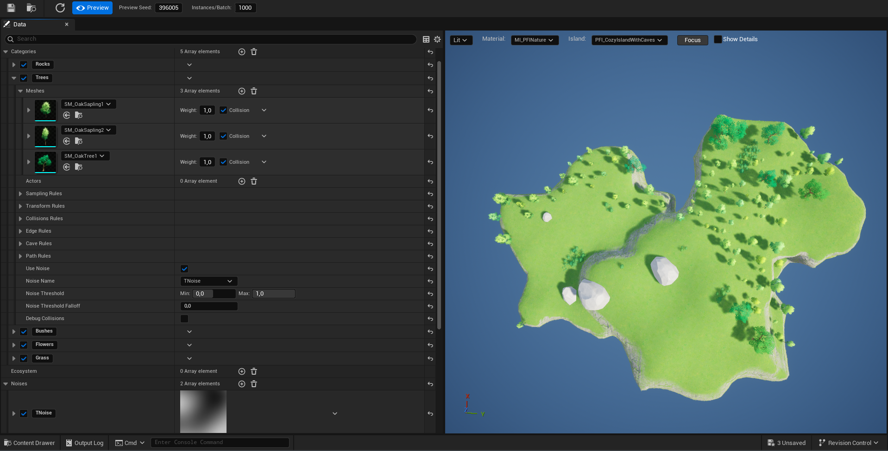
### Density and Distribution

| Parameter | Effect |
|---|---|
| Sampling Radius | Minimum spacing between instances |
| Max Sample Radius Ratio | Allows larger spacing in sparse regions |
| Max Samples / Max Instances | Hard caps on computation and final spawned count |
| Sub-Sample Density | Higher values improve distribution quality |
| Size Distribution | Uniform, biased toward Smaller, or biased toward Larger |
| Distribution Power | Strength of the size bias |
| Density Noise | Any noise layer defined in the asset can modulate the sampling radius spatially, creating dense clusters and open clearings automatically |

### Spatial Rules

**Surface Normal Filter** restricts spawning to surfaces within a defined slope range, expressed as a Z normal value from -1 to 1. A falloff softens the accepted boundary. An optional mesh pre-filter discards ineligible triangles before sampling begins, improving performance when large portions of the surface are excluded.

**Cave Rules** offer three modes per category: spawn everywhere, only inside caves, or only outside caves. A configurable distance threshold adjusts detection accuracy near cave boundaries.

**Path Rules** offer four modes: spawn everywhere, only inside a path corridor, only outside all paths, or in a soft band beside paths. Inner radius, outer radius, and falloff are each configurable independently, making it possible to line trails with rocks, clear grass from walkways, or create any corridor-based arrangement.

### Transform Rules

Each spawned instance receives a fully randomized transform built from per-category rules.

A world-space **position offset** shifts the instance along any axis within a defined range.

A **surface offset** works in local surface space, applying tangential jitter along the mesh face (X,Y) and a push or pull along the surface normal (Z).
Useful for embedding objetcs into the ground or floating objects above the surface.

**Scale** and **rotation** are both ranged per axis and resolved independently for each instance, ensuring no two placements look exactly alike.

**Align to Surface Normal** orients the object to stand flush against the surface it lands on rather than defaulting to world up, which is essential for placing objects on cave ceilings or steep cliffs. **Face Nearest Path** overrides the yaw to point the instance toward the closest path segment, naturally orienting rocks, signs, or props along a trail without any manual adjustment.

### Ecosystem Interactions

The ecosystem system defines spatial relationships between sampling categories that influence where elements are allowed to spawn relative to each other.

An interaction pairs a **source category** with a **target category**. Once the source is sampled, each of its instances projects an influence zone onto the target pass.

**Exclusion** prevents target instances from spawning within a defined distance of any source instance. No tree next to houses, for example. Both relative distances (scaled by source bounds) and absolute distances in centimeters are supported. A falloff softens the boundary, and an optional noise layer breaks up the edge organically so it never looks like a perfect circle.

**Inclusion** inverts the logic: target instances may only spawn within a defined distance of source instances. Mushrooms clustering near tree, for example.

Both rules can be combined on the same category pair. Ecosystem interactions are processed in category list order, so source categories must appear before their targets.

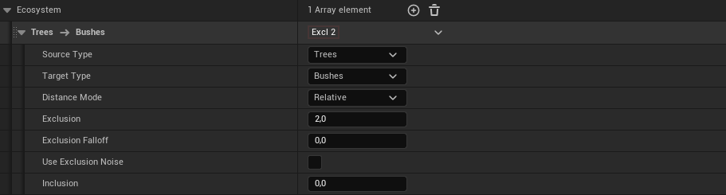
## Blueprint API

All operations, state queries, and events are exposed to Blueprints through the PFI Component.

**Functions:**

| Function | Description |
|---|---|
| Generate | Rebuilds the island from current parameters and seed |
| GenerateRandomSeed | Picks a new random seed and regenerates immediately |
| Clear | Destroys all generated meshes and instances |
| CancelGeneration | Aborts a generation task running in the background |
| ResetSampling | Rebuilds only the population without regenerating the mesh |
| GetTrianglesCount | Returns the current triangle count |
| GetVerticesCount | Returns the current vertex count |

**State Queries:**

| Query | Returns true when |
|---|---|
| IsReady | The island and all instances are fully in place |
| IsSpawning | Mesh chunks or instances are still being delivered |
| IsGenerating | The background task is still running |
| IsChunksSpawning | Mesh chunks are still being uploaded |
| IsSamplingSpawning | Instances are still being placed |

**Events:**

| Event | Fires when |
|---|---|
| OnGenerationFinished | The background computation completes |
| OnIslandSpawnFinished | All mesh chunks are on screen |
| OnSamplingFinished | All HISMCs and actors are placed |
| OnIslandReady | Everything is fully in place |

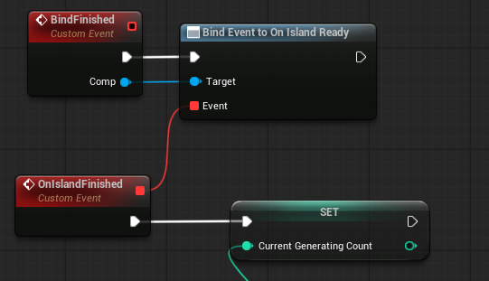
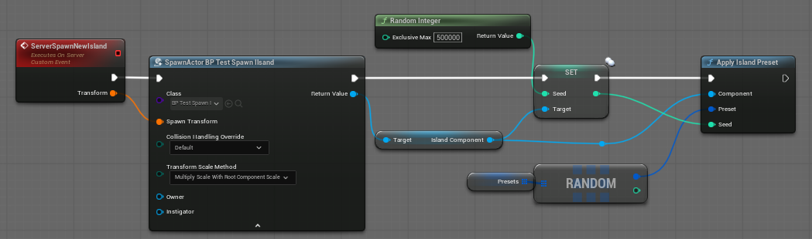
## Replication and Multiplayer

The seed, PFI Data reference, Sampling Data reference, material, collision settings, and sampling toggle are all marked as replicated. Generation is fully deterministic from the seed. Replicating a seed value to all clients is sufficient to reproduce the identical island on every machine without sending any mesh data over the network.

## Performance

**Background threading.** All geometry computation runs on a dedicated worker thread. The game thread is only involved when committing the final result to the render system.

**Progressive mesh delivery.** The island mesh is uploaded in configurable batches over multiple frames, spreading the GPU cost and keeping frame rates stable throughout generation.

**HISMC rendering.** All static mesh instances use `UHierarchicalInstancedStaticMeshComponent`, the most efficient instancing primitive in Unreal Engine. Thousands of trees, rocks, or props render with a minimal draw call footprint.

**Triangle simplification.** The internal pipeline always runs at full resolution. A configurable output cap guarantees a maximum render cost for any generated island, regardless of generation settings.

**SDF remesh for complex topology.** When caves and sub-islands produce irregular or open geometry, SDF remeshing produces a clean, well-distributed watertight mesh that simplifies efficiently and collides accurately.

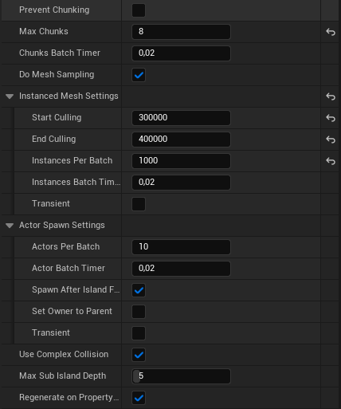

## Extensibility for Developers

**Custom Generator Factory.** `UPFIGeneratorFactory` is a pluggable factory controlling which generation task is instantiated. Subclass it and assign it to the component to substitute a fully custom generation algorithm while keeping the rest of the pipeline intact.

**IPFISpawnable Interface.** Actor classes spawned through the sampling system can implement `IPFISpawnable` to receive an `OnSpawned` callback immediately after placement, providing a deterministic seed and a reference to the island component. A `GetSpawnableBounds` method allows the actor to report its own collision bounds precisely, avoiding the cost of temporarily spawning and measuring it at runtime.

**Custom Data POD.** Both `UPFIData` and `UPFISamplingData` expose a `CreateCustomDataPOD` virtual method for attaching strongly-typed custom data to the generation payload. This data is accessible inside a custom generation task, enabling full pipeline extensions without modifying any base class.
